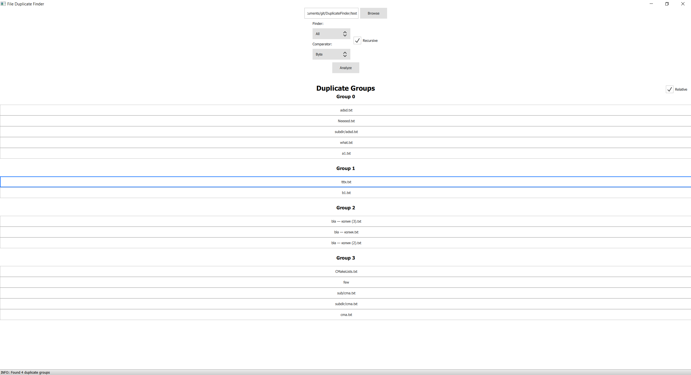

# File Duplicate Finder
Application to find file duplicates in two directories

## Prerequisites
* CMake >= 3.1
* Qt 5.12
Gdhdhd
## How to build
* Create build directory inside repo folder
```shell
mkdir build
cd build
```
* Run CMake
```shell
cmake ..
```
* Build
```shell
make
```

## Usage
* Run DuplicateFinder
* Choose directories
* Choose finder
  * __Sequential__ - find duplicates sequentially
  * __Concurrent__ - find duplicates in parallel (per file in left folder)
* Choose comparator
  * __Byte__ - compare by content
  * __Hash__ - compare by SHA1 hash
* Click "Analyze" button
* As result you will see groups of duplicates


## Known limitations
* Application may be slow on a big amount of files or huge sizes
* Usage of Hash comparator loads whole file in memory (better not use for big files)
