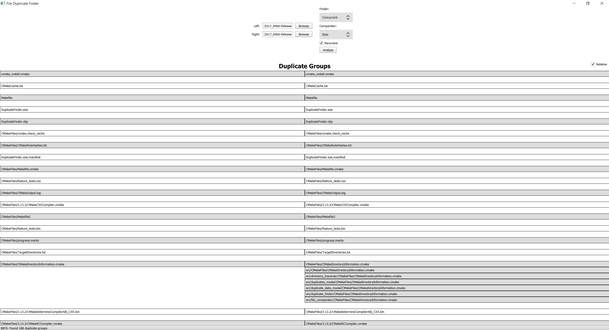

# File Duplicate Finder
Application to find file duplicates in a directory

## Prerequisites
* CMake >= 3.1
* Qt 5.12

## How to build
* Create build directory inside repo folder
```shell
mkdir build
cd build
```
* Run CMake
```shell
cmake ..
```
* Build
```shell
make
```

## Usage
* Run DuplicateFinder
* Choose directory and file comparator
* Click "Analyze" button
* As result you will see duplicate groups with relative paths


## Known limitations
* Application may be slow on a big amount of files (or file sizes)
